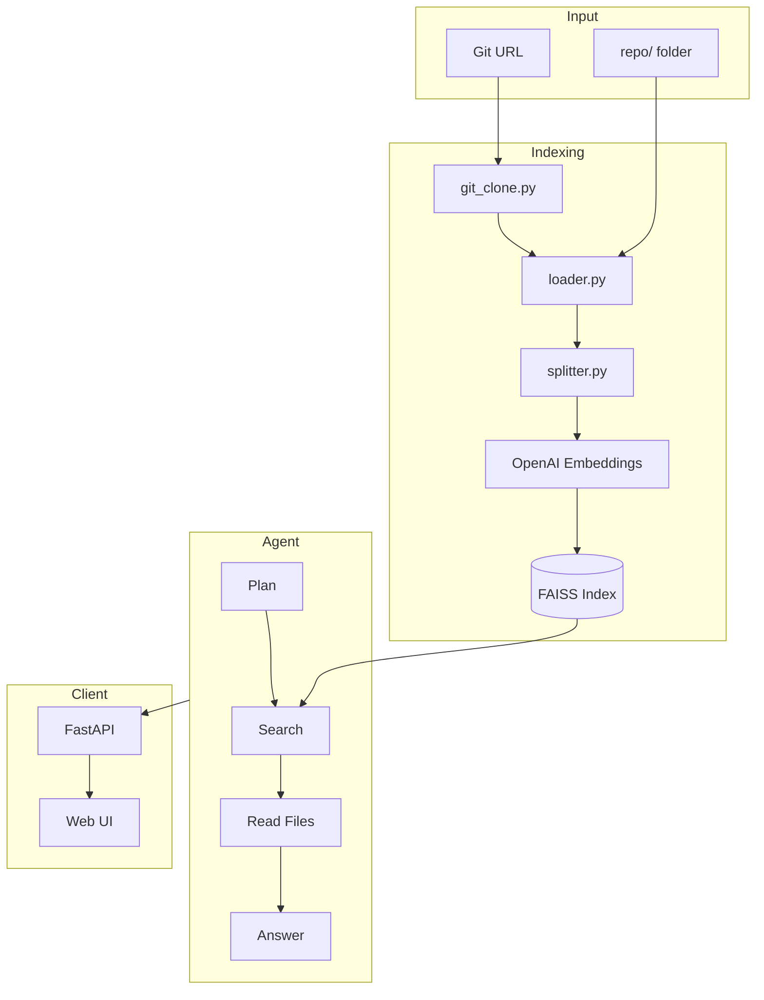

# AI Repository Analysis Agent

An AI-powered agent that analyzes software repositories using **Retrieval-Augmented Generation (RAG)**, **LangChain**, and **LangGraph**. Index a Git repository, ask natural-language questions, and get answers grounded in actual source code — with file references and follow-up chat.

[](https://www.python.org/)
[](https://www.langchain.com/)
[](https://langchain-ai.github.io/langgraph/)
[](https://fastapi.tiangolo.com/)
[](https://www.docker.com/)
[](https://github.com/facebookresearch/faiss)

---

## The Problem

Understanding an unfamiliar codebase is slow and painful:

- **Where is authentication handled?**
- **How does the database layer work?**
- **Which files use JWT?**

Traditional keyword search fails when you don't know the exact function or file names. Reading every file manually doesn't scale.

This project solves that by combining **semantic code search** with an **AI agent** that can explore, read, and reason about your repository — then answer in plain language with source references.

---

## What It Does

1. **Clones or loads** a codebase from a Git URL or local `repo/` folder
2. **Indexes** code into a FAISS vector store using OpenAI embeddings
3. **Searches** semantically — find relevant code by meaning, not just exact text
4. **Analyzes** via a LangGraph agent with tools for search, file reading, grep, and listing
5. **Answers** questions with cited files and supports **follow-up conversation**
6. **Exposes** everything through a FastAPI REST API, web UI, and Docker

---

## Features

| Feature | Description |
|---------|-------------|
| **RAG pipeline** | Load → chunk → embed → store in FAISS |
| **Git clone input** | Index directly from a GitHub/Git URL |
| **Language-aware splitting** | LangChain splitters for Python, JS, TS, Go, Rust, and more |
| **Semantic search** | Natural-language queries over indexed code |
| **LangGraph agent** | Structured flow: plan → search → read → answer |
| **Agent tools** | `search_codebase`, `read_file`, `grep_code`, `list_files` |
| **Follow-up chat** | Multi-turn conversation with history-aware answers |
| **Streaming API** | Live progress for indexing and Q&A via SSE |
| **Web UI** | Minimal grey-blue interface with step indicators |
| **REST API** | `POST /ask`, `POST /index`, streaming endpoints, `GET /health` |
| **Docker support** | One-command setup with `docker compose up` |

---

## Tech Stack

| Layer | Technology |
|-------|------------|
| **Language** | Python 3.12 |
| **LLM orchestration** | LangChain, LangGraph |
| **Embeddings** | OpenAI `text-embedding-3-small` |
| **Vector database** | FAISS (local, persisted to disk) |
| **API** | FastAPI + Uvicorn |
| **Frontend** | HTML, CSS, JavaScript (static) |
| **Containerization** | Docker, Docker Compose |
| **Config** | python-dotenv |

---

## Architecture



---

## Quick Start

### Prerequisites

- Python 3.12+
- [OpenAI API key](https://platform.openai.com/api-keys)
- Git (for cloning repositories)
- Docker *(optional)*

### 1. Clone & install

```bash
git clone https://github.com/MLH99/ai-repo-analysis-agent.git
cd ai-repo-analysis-agent

python -m venv .venv
source .venv/bin/activate        # macOS / Linux
# .venv\Scripts\activate         # Windows

pip install -r requirements.txt
```

### 2. Configure

```bash
cp .env.example .env
# Add your OpenAI API key to .env
```

### 3. Index a repository

**Option A — clone from Git:**

```bash
python scripts/build_index.py --git-url https://github.com/user/repository.git
```

**Option B — use local files in `repo/`:**

```bash
# copy your project into repo/, then:
python scripts/build_index.py
```

**Option C — use the included demo:**

```bash
Copy-Item -Recurse test_project\* repo\   # Windows
python scripts/build_index.py
```

### 4. Ask a question

```bash
python scripts/ask.py "Where is authentication handled?"
```

### 5. Use the Web UI

```bash
python scripts/run_api.py
```

Open [http://127.0.0.1:8000](http://127.0.0.1:8000), enter your API key and Git URL, index the repo, and start chatting.

---

## Usage

### CLI

| Command | Description |
|---------|-------------|
| `python scripts/build_index.py` | Index the codebase in `repo/` |
| `python scripts/build_index.py --git-url URL` | Clone a repo, then index it |
| `python scripts/clone_repo.py URL` | Clone only (no indexing) |
| `python scripts/search.py "query"` | Raw semantic search (no LLM) |
| `python scripts/ask.py "query"` | Ask the agent (graph mode) |
| `python scripts/ask.py "query" --mode react` | Ask with all tools (flexible) |
| `python scripts/run_api.py` | Start the FastAPI server + Web UI |

### Web UI

The UI supports:

- OpenAI API key input (sent per request, not stored server-side)
- Git repository URL and branch
- Live indexing progress with step indicators
- Chat interface with follow-up questions
- Clear chat history

### API

Start the server:

```bash
python scripts/run_api.py
```

- **Web UI:** [http://127.0.0.1:8000](http://127.0.0.1:8000)
- **Swagger docs:** [http://127.0.0.1:8000/docs](http://127.0.0.1:8000/docs)

| Method | Endpoint | Description |
|--------|----------|-------------|
| `GET` | `/health` | Health check |
| `POST` | `/ask` | Ask a question |
| `POST` | `/ask/stream` | Ask with streaming progress (SSE) |
| `POST` | `/index` | Index a codebase |
| `POST` | `/index/stream` | Index with streaming progress (SSE) |

**Ask with conversation history:**

```bash
curl -X POST http://127.0.0.1:8000/ask \
  -H "Content-Type: application/json" \
  -d '{
    "question": "Show me the login endpoint",
    "history": [
      {"role": "user", "content": "How does authentication work?"},
      {"role": "assistant", "content": "Authentication is handled in app/auth.py..."}
    ]
  }'
```

**Clone and index from GitHub:**

```bash
curl -X POST http://127.0.0.1:8000/index \
  -H "Content-Type: application/json" \
  -d '{"git_url": "https://github.com/user/repository.git", "branch": "main"}'
```

### Docker

```bash
# 1. Set OPENAI_API_KEY in .env
# 2. Optionally add code to repo/, or index via the UI/API after startup
docker compose up --build
```

| Volume | Purpose |
|--------|---------|
| `./repo` | Your codebase (mount point) |
| `./data` | Persisted FAISS index |

---

## Project Structure

```
ai-repo-analysis-agent/
├── repo/                  # ← Put your codebase here (not committed)
├── test_project/          # Optional demo project
├── data/                  # FAISS index (generated)
├── static/                # Web UI
├── src/
│   ├── git_clone.py       # Clone Git repositories
│   ├── conversation.py    # Multi-turn chat helpers
│   ├── loader.py          # Load source files
│   ├── splitter.py        # Language-aware chunking
│   ├── indexer.py         # Build FAISS index
│   ├── search.py          # Semantic search
│   ├── agent.py           # Agent entry point
│   ├── prompts.py         # Shared LLM prompts
│   ├── graph/             # LangGraph pipeline
│   ├── tools/             # LangChain tools
│   └── api/               # FastAPI application
├── scripts/
├── docker/
├── Dockerfile
└── docker-compose.yml
```

---

## Configuration

| Variable | Default | Description |
|----------|---------|-------------|
| `OPENAI_API_KEY` | — | Required. Your OpenAI API key |
| `REPO_PATH` | `repo` | Codebase directory (Docker) |
| `INDEX_PATH` | `data/faiss_index` | FAISS index location (Docker) |

The Web UI can also pass `openai_api_key` per request without storing it in `.env`.

---

## Supported File Types

`.py` · `.js` · `.ts` · `.tsx` · `.jsx` · `.java` · `.go` · `.rs` · `.md`

---

## Example Output

**Question:** `Where is authentication handled?`

**Answer:**
> Authentication is primarily handled in `app/auth.py` and `app/main.py`.
>
> - `authenticate_user()` validates email and password
> - `create_access_token()` generates JWT tokens
> - `/auth/login` and `/auth/register` endpoints in `app/main.py`

**Follow-up:** `Show me the login endpoint`

**Answer:**
> The login endpoint is defined in `app/main.py` as `@app.post("/auth/login")`...

---

## Roadmap

- [x] Git repository cloning as input
- [x] Streaming responses in API
- [x] Web UI for querying
- [x] Follow-up conversation / chat history
- [ ] Support for additional embedding providers (local models)

---

## License

This project is open source. Add a license before publishing (e.g. MIT).

---

## Author

Built as a learning project exploring **RAG**, **AI agents**, and **codebase analysis** with modern LLM tooling.
